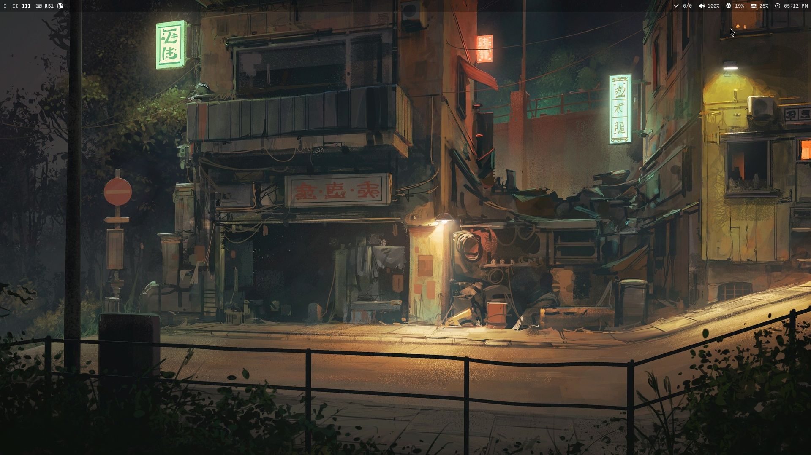

# Dotfiles

### Info
- Window manager: sway
- Terminal emulator: alacritty
- Shell: zsh
- Editor: neovim
- Other: tmux, swaylock, swaycons, firefox

### Installation
To install, run `make sync -s`. This command creates symbolic links, and once the installation is complete, there is no need to run it repeatedly.

### Screenshots

